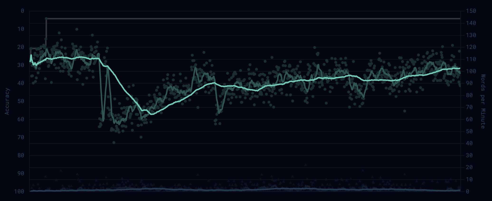

**serial\_typist:**

*Purpose:* A program that analyses my typing patterns through a video feed and recorded keypresses and returns a feedback email that encapsulates its findings after each session is done recording. 

More intricately, the program taps into a stream from my phone that has been rigged on top of my typing setup to store the positions of my fingers at the point of each keypress and fuse the same data with the keypresses recorded after a Mediapipe overlay has been added on the video post its recording. This allows me to notice the biomechanical errors in my typing style in order to accelerate my ability to type and the efficiency in increasing my typing speed. 

*Motivations:* For the past half-year, I have been quite a consistent fan of the typing website [*monkeytype.com*](http://monkeytype.com) and I noticed how, even after daily efforts, my typing speeds were starting to plateau. Initially, I used to practice two-fingered typing but with this revelation, I began to look closer into how I pressed each key. Slowly, I transitioned into using all the fingers for their right keys, which led to my speed taking a nosedive. 

 
*(The fall is where I started to practice touch-typing)*

After analysing some other biomechanical movements, I thought I could utilise a pipeline that fused my inputs with a video recording to get a deeper analysis into my typing mechanisms and so, this project was born. 

In this repo, you can find my attempt at demarcating this initially monstrous project into smaller phases which were further divided into files. 

* **Phase 1: Hardware and Video Pipeline:** This is mainly managed by the capture\_p1.py file, which checks for keypresses when activated, maintains a 2-second buffer till then, and keeps the video rolling until 2 seconds after the final keypress. It then cuts the stream according to those timestamps and stores it for the analysis of the finger positions.   
* **Phase 2: The MediaPipe API:** This took the video as an input and overlaid landmarks onto the video using MediaPipe’s mp.solutions.hands API and their strongest analysis model. This would ensure that the approximate position of each fingertip was marked for the fusion stage.   
* **Phase 3: Fusion (Finger-to-Key Assignment):** This was the most iterative section of the project and also the one where I encountered the most failure. There were 4 concrete ideas pursued in order to tuple a keypress to a specific finger.   
  * v1: The initial hypothesis was utilizing the Z-velocity recorded by MediaPipe to notice which key is being pressed in the video. More technically, the pipeline chose the key with the highest downward Z-velocity at the time of the keystroke.   
    * *Why it failed:* The Z-values were attributed specifically to the **hand** instead of a specific finger and so, the results were very noisy. Another reason was because the rig was being recorded from the top down, it was very difficult to catch a z-value change, especially at \~50 FPS.   
  * v2: With this, I took advantage of the QWERTY layout and annotated the left hand to the left side of the keyboard and the same for the right side. Then, I tried to use spatial positioning to check which fingertip was closest to the learned location of the key,   
    * *What failed:* Not much since we did manage to secure \~84% accuracy with the finger and a 97% accuracy with the hand-only accuracy when marking the finger assignments of the frames manually. The mistakes were mainly with adjacent fingers or excessive traffic in a smaller area of the keyboard.   
    * An important thing to mention here was that I noticed heavy misallocation of the markings with the backspace because I usually use the right-ring finger to press it, contrary to the right pinky that is assigned by canonical touch-typing. This was fixed by hard-coding the finger that associated with it but it was later mentioned during the feedback layer since it was non-optimal.   
  * v2.1: Tracked motion across a 7-frame window that was centered around the press. The fastest finger (or the most high-velocity one) was flagged as the one that pressed the key. **Result:** 58%  
    * *Why it failed:* For fast home-row typing, the hypothesis was entirely opposite: the fingers that press the key actually move the least since they are the closest to the key.   
  * v2.2: Tested wrist-relative coordinates as another path to push past v2’s accuracy but resulted in 80.3%. The hypothesis was based on the fact that the wrist was a stable anatomical reference which should, in theory, reduce the sensitivity to hand drift.   
    * *Why it failed:* After testing, I noticed that the wrist landmarks actually jitter more than initially expected.   
  * Pushing past 84.8% would have required a learned per-user classifier and substantially more labeled data than 66 events. The analyses I actually want to run — same-finger penalty, bigram-by-category timing, finger workload distribution — are aggregate-level findings that average out adjacent-finger errors. The same patterns surface at 84.8% as they would at 95%.  
  * Crucial mathematical evidence for the same ceiling: Spatial signal-to-noise math worth including: 27 pixels per cm at the rig configuration. Home-row press depth is \~5mm, which translates to \~13 pixels of finger descent. MediaPipe jitter is several pixels. S/N ratio \~2:1. 

* **Phase 4: Creating a d(a)emon:** Building a long-running, continuous daemon that captures keystrokes via pynput, manages session boundaries, and triggers analysis automatically. The commands for starting the daemon and initiating a session were written as JSON lines for simplicity and debuggability. Specific choices made in constructing the daemon:  
  * Spawning capture\_p1.py as a subprocess rather than reimplementing video capture within the daemon since it felt redundant in comparison to a tested code path. *However,* it resulted in the loss of the pre-roll buffer.   
  * Switch from auto-detection of sessions to manual-only for explicit control over session boundaries. I felt it was a way to reduce possible failure modes while allowing me greater control over the quality of sessions it recorded.   
  * This was later boiled down to a selection of commands for further simplicity.   
  * Threshold settings for auto-analysis: 200 letter keystrokes minimum, 60% letter fraction to reduce non-typing activity from cluttering the analysis pipeline.   
  * Automated a pipeline that was activated within the daemon: keystroke capture → video capture (if enabled) → landmark extraction → fusion → analyze → feedback → email.   
  * Six commands cropped to two via the bash wrapper. `typist begin --record` / `typist end` are mainly the only commands needed when using the software. 

* **Phase 5: Behavioral Analysis Layers within [analysis.py](http://analysis.py):**   
  * Backspace tracing: Note the backspace in the log and backtrace to find the preceding character which, over the course of a session, can return ranked error bigram patterns that highlight the biomechanical inefficiencies.   
  * New test detection: Flags the combination of tab \+ space (the shortcut to a fresh test on monkeytype) to analyse the preceding keypresses for the aforementioned reason.   
  * Ergonomic deviations: Cross-referencing the touch-typing norms for each key with the key-finger tuples to highlight the deviations and point out within the feedback.   
      
* **Phase 6: Coaching note generator ([feedback.py](http://feedback.py)) sent by email:** Collates the analysis generated into an easily digestible format which highlights specific parts of each session (amt of keypresses, highest WPM burst). More specifically:  
  * Compares current data with previous data and checks whether it crosses a threshold before flagging it within the email. Also ensures that the comparison being flagged is meaningful by adding a threshold (\>5% movement, 3+ session recurrence).   
  * Drill words generation: \~350 word common English wordlist which returns bigram specific drills targeting the slowest bigrams within the session.   
    * I chose not to use an LLM for the feedback to reduce the API dependency and prioritise predictability over hallucinating optimism.   
  * Wrote a Markdown → HTML converter which converted the output of [feedback.py](http://feedback.py) to an email format. 

*Limitations:*

* 84.8% ceiling accuracy for v2 (or phase three): Constrictions based on the FPS (30-50 at max) that I could record with using my phone as well as the timeline of the project. Also worth mentioning is that this accuracy is a per-event accuracy on the 66-event ground truth labeled set ([label.py](http://label.py)) while the aggregate findings are impervious of this noise since it averages out the confusions.   
  * Worth mentioning: retesting by increasing the size of the labelled ground truth dataset could change the confidence intervals for the same, which I haven’t experimented with yet.   
* Rig framing sensitivity. The fusion's affine residual jumps from 5.6% (my labeled session) to 12.7%-15.1% (other sessions) when only one hand is in frame or when the phone position differs slightly. The system assumes consistent rig framing across sessions; in practice that's not always true.  
* macOS-specific since the daemon uses launchd and the Accessibility permission system, meaning cross-platform support would require significant rework.   
* Single-user specific: The fusion learns the centroid of the fingertips that pressed each key in a single user’s session, meaning that data cannot be generalised to another typist without adding a users function.   
* The daemon logs every keystroke during active sessions, including in any application. Manual-only sessions mitigate this by requiring an explicit `typist begin`, but it's worth knowing if you adapt this for your own use.

*What's in the repo*

The project is organized around the pipeline stages described above, with one Python file per stage:

* `capture_p1.py` — video capture from the IP Webcam stream and synchronized keystroke logging. Maintains a 2-second pre-roll buffer.  
* `landmark_extractor_p2.py` — runs MediaPipe Hands inference over recorded video and writes per-frame landmark data to `landmarks.csv`.  
* `fuse_v2.py` — the production fusion script. Takes landmarks \+ keystrokes, outputs per-event finger assignments. Earlier iterations (v1, v2.1, v2-wrist) live in `fuse_testing/` for reference.  
* `label.py` — the ground-truth labeling tool used to generate the 66-event labeled set that every accuracy claim rests on.  
* `analyze.py` — session analytics: timing fundamentals, bigram analysis, finger workload, behavioral patterns. Outputs `report.md`, `analysis.json`, and three CSVs.  
* `aggregate.py` — concatenates multiple sessions and runs `analyze.py` over the merged data for cross-session aggregation.  
* `typist_daemon.py` — the long-running daemon. Captures keystrokes, manages session boundaries, spawns the video subprocess, and triggers the full pipeline on session end.  
* `typist` — bash wrapper that compresses the daemon workflow to two commands.  
* `feedback.py` — coaching note generator. Reads `analysis.json`, optionally loads previous sessions for historical context, produces `feedback.md`, and emails it.  
* `com.serialtypist.daemon.plist` — launchd manifest for the daemon.  
* `stream_test.py` — utility for verifying the IP Webcam stream is reachable.  
* `DECISIONS.md` — running log of architectural decisions and falsified hypotheses.

### **How to use it**

#### **Setup**

Install dependencies: `pip install pynput pyyaml python-dotenv mediapipe opencv-python numpy`. The project assumes a venv at `.venv/`.

Set up the IP Webcam stream on your phone (the [Android app](https://play.google.com/store/apps/details?id=com.pas.webcam) was used for this project). Mount the phone above your typing area so the keyboard and your hands are visible from above. Verify the stream is reachable with `python stream_test.py`.

Configure email delivery (optional). Create a `.env` file in the project root:

`GMAIL_ADDRESS=your.email@gmail.com`

`GMAIL_APP_PASSWORD=xxxx xxxx xxxx xxxx`

`EMAIL_RECIPIENT=your.email@gmail.com`

Use a Gmail app password, not your account password. If credentials aren't set, `feedback.md` is still written locally — email is opportunistic.

Install the daemon plist:

`cp com.serialtypist.daemon.plist ~/Library/LaunchAgents/`

Grant macOS Accessibility permission to your Python interpreter (`System Settings → Privacy & Security → Accessibility`) so the daemon can capture keystrokes.

Make the bash wrapper executable and add it to your PATH:

`chmod +x typist`

`sudo ln -sf "$(pwd)/typist" /usr/local/bin/typist`

#### **Daily workflow**

Before typing, with the rig set up:

`typist begin --record`

This loads the daemon (if not running), enables video recording, and starts a new session.

Type for as long as you want. The daemon captures keystrokes continuously and the video subprocess records the rig stream.

When you're done:

`typist end`

The daemon ends the session, runs the full pipeline (landmarks → fusion → analysis → coaching note), and emails the result. Allow \~45 seconds for processing.

If you're done typing for the day and want to unload the daemon entirely:

`typist end --shutdown`

#### **Other commands**

* `typist status` — current daemon state, session progress, recording flag  
* `typist sessions` — recent sessions and their analysis status  
* `typist log [N]` — tail the daemon log

#### **Sessions without video**

Skip the `--record` flag and the daemon captures only keystrokes. The biomechanical pipeline (fusion, per-finger analysis) is skipped; the timing/bigram/error-pattern analysis still runs. Useful for sessions where the rig isn't set up.
